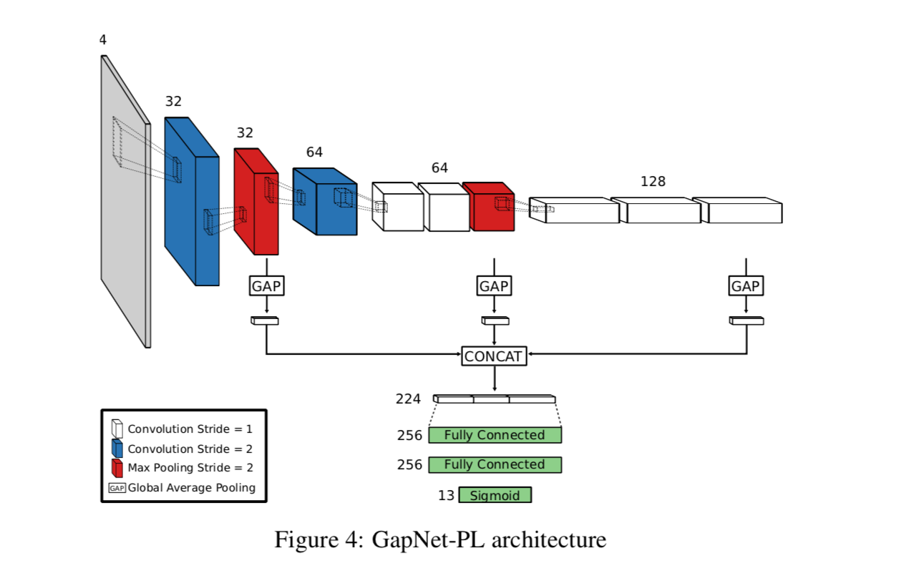

# GAPNet-PL
This is the implementation of GAPNet-PL for Paper <i>HUMAN-LEVEL PROTEIN LOCALIZATION WITH CONVOLUTIONAL NEURAL NETWORKS</i>.

The whole project is used for competition <a href="https://www.kaggle.com/c/human-protein-atlas-image-classification">Human Protein Atlas Image Classification</a>. 
Most of the code is refered to <a href="https://www.kaggle.com/rejpalcz/gapnet-pl-lb-0-385">GapNet-PL [LB 0.385]</a>.

## Usage
Open terminal and tap:
```python
python predict.py
```

